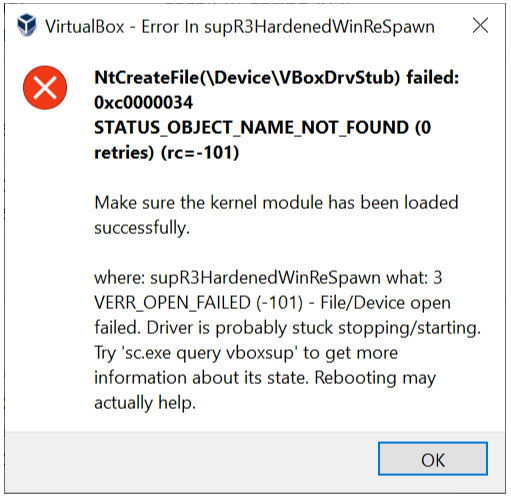

# 1. Pull the docker image and launch a docker container

Start a new terminal window to download and use a docker image with all environments setup for you (use `sudo` if docker commands ask for permission):

    git clone https://github.com/LENSS/csce438-spring2025.git

    cd csce438-spring2025

    docker pull liuyidockers/csce438_env:latest

    docker run -it --name csce438_container -v $(pwd)/mp1_skeleton:/home/csce438/mp1_skeleton liuyidockers/csce438_env:latest

    cd mp1_skeleton

# 2. try using server and client:

Compile the code using the provided makefile:

    make -j4

To clear the directory (and remove .txt files):
   
    make clean

To run the server without glog messages (port number is optional): 

    ./tsd <-p port>
    
To run the server with glog messages: 

    GLOG_logtostderr=1 ./tsd <-p port>

To run the client (port number and host address are optional), you need to open another terminal window, and enter into the launched docker container: 

    docker exec -it csce438_container bash
    cd mp1_skeleton
    ./tsc <-h host_addr -p port> -u user1
    
To run the server with glog messages: 

    GLOG_logtostderr=1 ./tsc <-h host_addr -p port> -u user1

# 3. Trouble shooting 

## 3.1 Problem regarding pulling docker images or launching docker containers for Mac M1/M2

We don't have a Mac M1/M2 laptop. From our experiences, in principle, the following solutions should work for your Mac M1/M2.

Warning!!! For MP3, you have to use docker on an x86 machine. If you don't have an x86 machine for MP3, we have 1-2 x86 ubuntu desktops in our lab for you to use. But it requires you physically sit in our lab to use them (i.e., you cannot take them home). Please let us know if you need to use them.

### Solution 1 (if you still want to use docker for MP 1, MP2.1, MP2.2): inside ubuntu, build the docker image from scratch

    docker build --platform linux/arm64 -t csce438_env .

    docker run -it --name csce438_container -v $(pwd)/mp1_skeleton:/home/csce438/mp1_skeleton csce438_env

    ./setup-438-env.sh

    cd mp1_skeleton

### Solution 2 (if you don't want to use docker for MP1, MP2.1, MP2.2): inside ubuntu, build the environment from scratch without docker

1. put the two files (`.bash aliases` and `etup-438-env.sh`) under the ubuntu home directory, i.e., `home/csce438`
2. start a new terminal, run `echo $MY_INSTALL_DIR`, and make sure you see the following output: /home/csce662/.local. Then you run `mkdir -p $MY_INSTALL_DIR`.
3. make sure you are still under the ubuntu home directory, i.e., `home/csce438`. Run the following two commands:

    `chmod 755 ./setup-438-env.sh`

    `./setup-438-env.sh`
4. Your environment should be set up now. Go to skeleton code folder: `cd mp1_skeleton` and `make -j4`

## 3.2 Problem regarding starting Ubuntu virtual machine in VirtualBox on Windows computers

You may encounter the "NtCreateFile(\Device\VboxDrvStub) failed" shown in the figure below. Please see if this [youtube video](https://www.youtube.com/watch?v=9FYREN6UPsM) helps. You may have to reboot your windows computer in the middle of the youtube solution.

