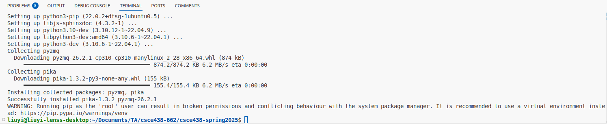

# 1. on a ubuntu terminal, create a rabbitmq container that can communicate with your newly created csce438_mp2_2_container

Instead of using one giant container, we use two docker containers as docker containers are supposed to be lightweight. One container that consumes too much resources may be slow. Here, please make sure your `csce438_mp2_2_container` is active/runnning as you were doing in MP2.1.

## 1.1 create a new docker network named `rabbitmq_net` allowing inter-container communications, i.e., bridge:

    docker network create rabbitmq_net

## 1.2 create a docker container that has the same environment of MP2.1

Like what we did in 2.1, copy the folder of your MP2.1 to a new folder named `mp2_2`. Copy the 6 source code files in this `mp2-2_skeleton` folder to the created `mp2_2` folder: synchronizer.cc, coordinator.proto, Makefile, startup.sh, stop.sh, setup.sh.

Create a container `csce438_mp2_2_container` that has the same environment of MP2.1, attach this `csce438_mp2_2_container` to the created docker network `rabbitmq_net` with `--network rabbitmq_net`:

    docker run -d --name csce438_mp2_2_container --network rabbitmq_net -v $(pwd)/mp2_2:/home/csce438/mp2_2 liuyidockers/csce438_env:latest tail -f /dev/null

## 1.3 create a rabbitmq docker container that uses rabbitmq_net for inter-container communications:

    docker run -d --name rabbitmq_container -p 5552:5552 -p 15672:15672 -p 5672:5672 -e RABBITMQ_SERVER_ADDITIONAL_ERL_ARGS="-rabbitmq_stream advertised_host rabbitmq" --network rabbitmq_net rabbitmq:3.13

## 1.4 check two containers are connected with the `rabbitmq_net`

Alright, let's verify if the two containers (`rabbitmq_container` and `csce438_mp2_2_container`) are connected to the docker network `rabbitmq_net`. With the command below, you should be able to see all active/running containers that are connected with `rabbitmq_net` like the image shown below the command:

    docker ps --filter network=rabbitmq_net

    docker network inspect rabbitmq_net

# 2. Additional configurations to two containers

The commands in this step 2 are supposed to run on your ubuntu terminals, not on your docker container terminals.

## 2.1 configurations for `rabbitmq_container`

Enable rabbitmq_stream and rabbitmq_stream_management plugins for RabbitMQ

    docker exec rabbitmq_container rabbitmq-plugins enable rabbitmq_stream rabbitmq_stream_management

## 2.2 configurations for `csce438_mp2_2_container`

Make the script executable, execute the setup.sh script in the `csce438_mp2_2_container`, you would be able to see the information shown in the picture below:

    docker exec csce438_mp2_2_container chmod +x /home/csce438/mp2_2/setup.sh 
    docker exec csce438_mp2_2_container bash /home/csce438/mp2_2/setup.sh 

- Viewing the activity in the RabbitMQ queues during development: 

    - You can visit the RabbitMQ Management Plugin UI at http://localhost:15672/ on your ubuntu VM and login with the credentials: 
        - Username: guest
        - Password: guest

    - The management UI is very useful and is implemented as a single page application which relies on the HTTP API. Some of the features include: Declare, list and delete exchanges, queues, bindings, users, virtual hosts and user permissions.

# 3. try compiling and using coordinator:

Enter into the `mp2_2` folder of `csce438_mp2_2_container`

    docker exec -it csce438_mp2_2_container bash
    cd mp2_2

Compile the code (coordinator + your MP1) using the provided mp2.1 makefile:

    make -j4

To clear the directory (and remove .txt files):
   
    make clean

Use `startup.sh` to launch the coordinator, tsd, and synchronizers:

    ./startup.sh

Use `stop.sh` to kill all processes:

    ./stop.sh

Check out `TestCasesMP2.2.xlsx` for test cases.

# 4. during development/test, you might find the commands below useful

To avoid the inteferences of residual messages in the message queues in the `rabbitmq_container`:

    rabbitmqctl stop_app
    rabbitmqctl reset 
    rabbitmqctl start_app

To avoid the inteferences of residual files in `csce438_mp2_2_container`:

    rm -rf /dev/shm/*
    rm -rd ./cluster_*